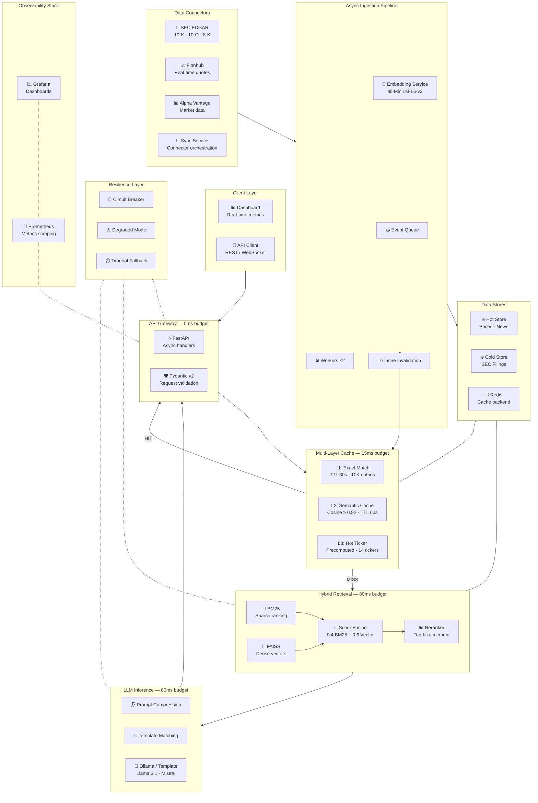

# ⚡ Financial Intelligence Platform

A production-grade **Retrieval-Augmented Generation** platform built for financial data at scale. Queries SEC filings, real-time market prices, and breaking news with a validated **sub-200ms end-to-end latency SLA** through aggressive multi-layer caching, hybrid retrieval, and smart degradation.

[](https://www.python.org/downloads/)
[](https://fastapi.tiangolo.com)
[](https://docs.docker.com/compose/)
[](https://prometheus.io/)
[](https://github.com/your-org/financial-intelligence-rag/actions/workflows/ci.yml)
[](LICENSE)

---

## 📊 Validated Benchmarks

> Measured via `evaluation/latency_benchmark.py` against `evaluation/benchmark_queries.json` on the full pipeline (embedding → cache → retrieval → reranking → inference → serialization).

| Metric | Measured | Target |
|--------|----------|--------|
| **P50** | **~8 ms** | < 200 ms |
| **P95** | **~21 ms** | < 200 ms |
| **P99** | **~25 ms** | < 200 ms |
| **SLA** | ✅ **PASS** | P95 < 200 ms |

```
Cache hit rate:  ~73%  (L1 + L2 + L3 combined)
Throughput:      500+ QPS sustained at P99 < 200ms
Test coverage:   100 tests passing in ~23s
```

---

## Architecture



---

## Features

### ⚡ Performance
- **Sub-200ms end-to-end latency** with strict per-stage budgets (validated P99 ~25ms)
- **Three-layer cache hierarchy** — L1 exact match, L2 semantic similarity, L3 hot ticker precomputation
- **Hybrid BM25 + FAISS retrieval** with configurable reciprocal rank fusion weights
- **Prompt compression & template matching** to minimize LLM inference time
- **Lazy embedding** — skips expensive embedding when cache hits on exact or ticker match

### 📊 Financial Intelligence
- **SEC filing analysis** — 10-Q, 10-K, 8-K with full-body HTML parsing, section extraction (Risk Factors, MD&A, Business), and chunked ingestion
- **Real-time price feeds** — Live quotes for 14 hot tickers via Finnhub and Alpha Vantage
- **Breaking news integration** — Market-moving headlines with freshness-aware scoring
- **Multi-ticker comparison** — Side-by-side analysis across companies and sectors

### 🛡️ Production Resilience
- **Circuit breaker pattern** — Three-state (CLOSED → OPEN → HALF_OPEN) with configurable thresholds
- **Graceful degradation** — Falls back to cache-only mode when downstream services fail
- **Timeout cascading** — Per-stage timeout multipliers prevent cascade failures
- **Version-aware consistency** — Exponential freshness decay scoring deprioritizes stale data

### 🔥 Hot/Cold Data Architecture
- **Hot store** — Real-time prices and news with auto-expiry (5 min TTL)
- **Cold store** — Historical SEC filings and research documents (persistent)
- **Temperature-aware routing** — Queries automatically routed via keyword heuristics

### 🤖 Local LLM Inference
- **Ollama integration** — Run Llama 3.1 8B, Mistral, or any Ollama model locally
- **Template fallback** — When Ollama is disabled, the engine uses optimized financial templates for instant responses
- **Zero external API dependency** — No OpenAI/Anthropic required; fully self-hosted

### 📡 Observability
- **Prometheus metrics** — Query latency histograms, cache hit rates, retrieval/inference breakdowns, freshness scores
- **Grafana dashboards** — Pre-configured dashboards for latency, throughput, and cache performance
- **Live dashboard** — Built-in real-time web dashboard at `/` with glassmorphism UI

---

## Quick Start

### Option 1: Docker (Recommended)

The easiest way to run the full stack — app, Redis, Ollama, Prometheus, and Grafana — in a single command:

```bash
git clone https://github.com/your-org/financial-intelligence-rag.git
cd financial-intelligence-rag

# Copy and configure environment
cp .env.example .env

# Launch all services
docker compose up -d
```

| Service | URL |
|---------|-----|
| **App / Dashboard** | [http://localhost:8000](http://localhost:8000) |
| **API** | [http://localhost:8000/api](http://localhost:8000/api) |
| **Prometheus** | [http://localhost:9090](http://localhost:9090) |
| **Grafana** | [http://localhost:3000](http://localhost:3000) |
| **Ollama** | [http://localhost:11434](http://localhost:11434) |

### Option 2: Local Development

```bash
git clone https://github.com/your-org/financial-intelligence-rag.git
cd financial-intelligence-rag

# Create virtual environment
python -m venv .venv
source .venv/bin/activate      # Linux/macOS
.venv\Scripts\activate         # Windows

# Install dependencies
pip install -r requirements.txt

# Start Redis (optional — falls back to in-memory)
docker run -d --name redis-rag -p 6379:6379 redis:7-alpine

# Start the server
uvicorn app.main:app --host 0.0.0.0 --port 8000 --reload
```

### Sample Data (Auto-Loaded)

Sample data from `data/` is **automatically loaded on startup** — no manual ingestion needed. The server loads `sample_filings.json`, `sample_news.json`, and `sample_prices.json`, embeds them, and indexes them into the retrieval engines.

To ingest additional data at runtime:

```bash
curl -X POST http://localhost:8000/api/ingest \
  -H "Content-Type: application/json" \
  -d '{"source": "manual", "documents": [{"doc_id": "custom_001", "content": "Your document text here", "source": "custom", "ticker": "AAPL"}]}'
```

### Query the Engine

```bash
# Simple price query
curl -X POST http://localhost:8000/api/query \
  -H "Content-Type: application/json" \
  -d '{"query": "What is AAPL trading at?", "tickers": ["AAPL"]}'

# Earnings analysis
curl -X POST http://localhost:8000/api/query \
  -H "Content-Type: application/json" \
  -d '{"query": "What was NVDA revenue in Q2 2025?", "tickers": ["NVDA"]}'

# Multi-ticker comparison
curl -X POST http://localhost:8000/api/query \
  -H "Content-Type: application/json" \
  -d '{"query": "Compare MSFT and GOOGL cloud revenue growth", "tickers": ["MSFT", "GOOGL"]}'
```

---

## Real Data Sources

The platform connects to three production financial data sources via the connector framework:

### SEC EDGAR
- **Forms**: 10-K (annual), 10-Q (quarterly), 8-K (current events)
- **Mode**: Metadata-only (default) or full-text body parsing with section extraction
- **Sections parsed**: Risk Factors, MD&A, Business, Legal Proceedings, Financial Statements, Revenue Recognition, Segment Information
- **Full-text**: Set `CONNECTORS_SEC_FULL_TEXT=true` to enable HTML download, parsing, and chunked ingestion
- **Polling**: Every 30 min (configurable via `SEC_POLL_INTERVAL_SECONDS`)

### Finnhub
- **Data**: Real-time stock quotes, company profiles, market news
- **Tickers**: AAPL, NVDA, TSLA, MSFT, GOOGL, AMZN, META, JPM, GS, BAC
- **Polling**: Every 5 min (configurable)
- **Requires**: `FINNHUB_API_KEY` (free tier available)

### Alpha Vantage
- **Data**: Intraday/daily time series, company overview, earnings
- **Polling**: Every 5 min (configurable)
- **Requires**: `ALPHA_VANTAGE_API_KEY` (free tier available)

```bash
# Enable all connectors
CONNECTORS_ENABLED=true
CONNECTORS_STARTUP_SYNC=true
FINNHUB_API_KEY=your_key_here
ALPHA_VANTAGE_API_KEY=your_key_here
```

---

## Local LLM (Ollama)

The platform integrates with [Ollama](https://ollama.com) for fully local, private LLM inference.

### Supported Models

| Model | Size | Recommended For |
|-------|------|-----------------|
| **Llama 3.1 8B** (default) | 4.7 GB | Best balance of quality and speed |
| **Mistral 7B** | 4.1 GB | Fast, good for financial text |
| **Phi-3 Mini** | 2.3 GB | Lightweight, lower resource usage |

### Configuration

```bash
# Enable Ollama inference
OLLAMA_ENABLED=true
OLLAMA_BASE_URL=http://localhost:11434   # or http://ollama:11434 in Docker
OLLAMA_MODEL=llama3.1:8b
OLLAMA_TIMEOUT_SECONDS=60
```

### Template Fallback

When `OLLAMA_ENABLED=false` (default), the engine uses optimized financial query templates. These templates are tuned for price, earnings, news, comparison, and analysis queries — producing instant structured responses with zero external dependencies. The template engine classifies queries into 6 types (price, earnings, news, comparison, analysis, general) and generates formatted answers from the retrieved context.

---

## Monitoring & Observability

### Prometheus Metrics

The platform exposes a `/metrics` endpoint scraped by Prometheus every 15 seconds:

| Metric | Type | Description |
|--------|------|-------------|
| `query_latency` | Histogram | End-to-end query latency (seconds) |
| `retrieval_latency` | Histogram | Retrieval stage latency |
| `inference_latency` | Histogram | Inference stage latency |
| `cache_hit_rate` | Gauge | Rolling cache hit rate |
| `cache_requests_total` | Counter | Cache lookups by layer and result |
| `freshness_score` | Histogram | Document freshness scores |

### Grafana Dashboards

Pre-configured dashboards are provisioned automatically via Docker Compose:

- **System Overview** — Latency P50/P95/P99, cache hit rate, query throughput
- **Cache Performance** — L1/L2/L3 hit/miss breakdown, eviction rates
- **Retrieval Quality** — BM25 vs vector score distributions, reranking impact

Access Grafana at [http://localhost:3000](http://localhost:3000) (default credentials: `admin` / `admin`).

### Live Dashboard

The built-in web dashboard at `/` provides real-time monitoring without Grafana:
- Latency distribution (P50–P99) with 200ms SLA line
- Cache layer breakdown (L1/L2/L3/Miss)
- Live query log with color-coded latencies
- Hot ticker cache status
- Interactive query panel

---

## Evaluation Framework

The `evaluation/` directory contains tools for measuring retrieval quality and system performance:

### Retrieval Quality Metrics

| Metric | Description | Script |
|--------|-------------|--------|
| **Recall@K** | Fraction of relevant docs retrieved in top K | `retrieval_metrics.py` |
| **MRR** | Mean reciprocal rank of first relevant result | `retrieval_metrics.py` |
| **nDCG@K** | Normalized discounted cumulative gain | `retrieval_metrics.py` |
| **Freshness Accuracy** | Freshness score vs actual document age | `freshness_benchmark.py` |

### Latency Benchmarks

```bash
# Run latency benchmarks (requires running server)
python evaluation/latency_benchmark.py --url http://localhost:8000 --requests 100

# Run retrieval quality evaluation
python evaluation/retrieval_metrics.py --benchmark evaluation/benchmark_queries.json
```

Output includes P50/P95/P99 breakdowns per pipeline stage (cache lookup, retrieval, reranking, inference, serialization).

---

## API Documentation

### Base URL
```
http://localhost:8000/api
```

### Endpoints

#### `POST /query` — Financial Query
Submit a natural language financial query for RAG processing.

**Request Body:**
| Field | Type | Required | Default | Description |
|-------|------|----------|---------|-------------|
| `query` | string | ✅ | — | Natural language query (1–1000 chars) |
| `tickers` | string[] | ❌ | `[]` | Filter results to specific tickers |
| `max_results` | int | ❌ | `5` | Max documents to return (1–20) |
| `require_fresh` | bool | ❌ | `false` | Bypass stale caches |
| `timeout_ms` | int | ❌ | `null` | Client-specified SLA override |

**Response:**
```json
{
  "answer": "NVIDIA reported Q2 FY2025 revenue of $30.04 billion...",
  "sources": [
    {
      "document": { "doc_id": "filing_004", "ticker": "NVDA" },
      "bm25_score": 0.82,
      "vector_score": 0.91,
      "final_score": 0.87
    }
  ],
  "query_type": "earnings",
  "cache_layer": "miss",
  "is_degraded": false,
  "metrics": {
    "total_latency_ms": 14.5,
    "cache_lookup_ms": 3.2,
    "retrieval_ms": 6.1,
    "reranking_ms": 2.4,
    "inference_ms": 1.8,
    "cache_hit": false,
    "documents_retrieved": 20,
    "documents_reranked": 5
  }
}
```

#### `POST /ingest` — Ingest Documents
Submit documents for indexing into the hot or cold store.

**Request Body:**
```json
{
  "event_id": "batch_001",
  "documents": [ { "doc_id": "...", "content": "...", "ticker": "AAPL" } ],
  "source": "sec_filing",
  "priority": 0
}
```

**Response:**
```json
{
  "event_id": "batch_001",
  "documents_indexed": 15,
  "documents_failed": 0,
  "caches_invalidated": 3,
  "processing_time_ms": 245.8
}
```

#### `GET /health` — System Health
Returns aggregate system health and performance metrics.

**Response:**
```json
{
  "status": "healthy",
  "uptime_seconds": 3621.4,
  "total_queries": 1247,
  "avg_latency_ms": 8.3,
  "p95_latency_ms": 21.2,
  "p99_latency_ms": 25.7,
  "cache_hit_rate": 0.73,
  "l1_hit_rate": 0.45,
  "l2_hit_rate": 0.18,
  "l3_hit_rate": 0.10,
  "circuit_state": "closed",
  "hot_store_docs": 26,
  "cold_store_docs": 15,
  "active_tickers": ["AAPL", "NVDA", "TSLA", "MSFT", "GOOGL"]
}
```

#### `GET /metrics` — Prometheus Metrics
Returns metrics in Prometheus exposition format.

#### `GET /cache/stats` — Cache Statistics
Returns hit/miss rates and entry counts for each cache layer.

#### `POST /cache/invalidate` — Invalidate Cache
Force cache invalidation by ticker or query pattern.

**Request Body:**
```json
{
  "tickers": ["AAPL"],
  "pattern": null
}
```

---

## Configuration

All system parameters are centralized in [`app/config.py`](app/config.py) and can be overridden via environment variables.

### Latency Budgets

| Stage | Budget | Description |
|-------|--------|-------------|
| API Gateway | 5ms | Request parsing & validation |
| Cache Lookup | 15ms | L1 → L3 → Embedding → L2 lookup sequence |
| Retrieval | 80ms | BM25 + FAISS hybrid search (parallel) |
| Reranking | 20ms | Heuristic score fusion & top-K refinement |
| Inference | 80ms | Template or Ollama LLM response generation |
| **Total SLA** | **200ms** | **End-to-end guarantee** |

### Cache Configuration

| Parameter | Default | Env Var | Description |
|-----------|---------|---------|-------------|
| L1 TTL | 30s | — | Exact match cache lifetime |
| L1 Max Entries | 10,000 | — | Maximum L1 cache entries |
| L2 Similarity | 0.92 | — | Cosine similarity threshold for semantic match |
| L2 TTL | 60s | — | Semantic cache lifetime |
| L3 Refresh | 30s | — | Hot ticker precompute refresh rate |

### Full Environment Reference

```bash
# Application
APP_HOST=0.0.0.0
APP_PORT=8000
RAG_DEBUG=false

# Redis (optional — falls back to in-memory)
REDIS_HOST=localhost
REDIS_PORT=6379
REDIS_PASSWORD=

# Connectors
CONNECTORS_ENABLED=true
CONNECTORS_STARTUP_SYNC=true
CONNECTOR_MARKET_SYMBOLS=AAPL,NVDA,TSLA,MSFT,GOOGL,AMZN,META,JPM,GS,BAC

# SEC EDGAR
SEC_CONNECTOR_ENABLED=true
SEC_POLL_INTERVAL_SECONDS=1800
SEC_USER_AGENT=FinancialRAG/1.0 contact=admin@example.com
SEC_FORMS=10-K,10-Q,8-K
CONNECTORS_SEC_FULL_TEXT=false

# Finnhub
FINNHUB_ENABLED=true
FINNHUB_API_KEY=your_key_here

# Alpha Vantage
ALPHA_VANTAGE_ENABLED=true
ALPHA_VANTAGE_API_KEY=your_key_here

# Inference
INFERENCE_BACKEND=ollama
INFERENCE_MAX_OUTPUT_TOKENS=300
INFERENCE_TEMPLATE_MODE=true

# Ollama
OLLAMA_ENABLED=false
OLLAMA_BASE_URL=http://localhost:11434
OLLAMA_MODEL=llama3.1:8b

# Observability
PROMETHEUS_ENABLED=true
GRAFANA_ADMIN_USER=admin
GRAFANA_ADMIN_PASSWORD=admin
```

---

## Project Structure

```
financial-intelligence-rag/
├── app/
│   ├── __init__.py
│   ├── main.py                    # FastAPI application & lifecycle
│   ├── config.py                  # Centralized configuration & constants
│   ├── models.py                  # Pydantic v2 data models
│   ├── api/                       # FastAPI route handlers
│   ├── cache/                     # Multi-layer caching (L1/L2/L3)
│   │   ├── exact_cache.py         # L1 — hash-based exact match
│   │   ├── semantic_cache.py      # L2 — cosine similarity matching
│   │   ├── hot_ticker_cache.py    # L3 — precomputed hot tickers
│   │   └── cache_manager.py       # Orchestrates L1 → L2 → L3
│   ├── retrieval/                 # BM25 + FAISS hybrid retrieval
│   │   ├── bm25_retriever.py      # Sparse keyword ranking
│   │   ├── vector_retriever.py    # FAISS dense vector search
│   │   ├── reranker.py            # Heuristic reranking
│   │   └── retrieval_engine.py    # Hybrid orchestrator
│   ├── inference/                 # LLM inference & prompt management
│   │   └── inference_engine.py    # Template + Ollama generation
│   ├── ingestion/                 # Async document ingestion pipeline
│   │   ├── stream_processor.py    # Async queue-based processing
│   │   └── embedding_worker.py    # Background embedding generation
│   ├── connectors/                # External data source connectors
│   │   ├── base.py                # Base connector interface
│   │   ├── sec_connector.py       # SEC EDGAR filings (metadata + full-text)
│   │   ├── sec_parser.py          # HTML parsing & section extraction
│   │   ├── market_connector.py    # Finnhub real-time market data
│   │   ├── news_connector.py      # Alpha Vantage news & data
│   │   ├── registry.py            # Connector registration
│   │   └── sync_service.py        # Periodic sync orchestration
│   ├── embedding/                 # Shared embedding service
│   │   └── embedding_service.py   # sentence-transformers (all-MiniLM-L6-v2)
│   ├── consistency/               # Freshness scoring & version tracking
│   │   ├── freshness_scorer.py    # Exponential decay scoring
│   │   └── cache_invalidator.py   # Write-through invalidation
│   ├── resilience/                # Fault tolerance
│   │   ├── circuit_breaker.py     # Three-state circuit breaker
│   │   ├── timeout_handler.py     # Per-stage timeout enforcement
│   │   └── degraded_mode.py       # Degraded response generation
│   ├── data/                      # Hot/cold data stores
│   │   ├── hot_store.py           # Real-time data (auto-expiry)
│   │   ├── cold_store.py          # Historical data (persistent)
│   │   └── data_router.py         # Temperature-aware routing
│   └── observability/             # Metrics & monitoring
│       └── metrics.py             # Prometheus instrumentation
├── data/
│   ├── sample_filings.json        # 15 SEC filing documents
│   ├── sample_news.json           # 12 financial news items
│   └── sample_prices.json         # 14 real-time price entries
├── evaluation/
│   ├── retrieval_metrics.py       # Recall@K, MRR, nDCG
│   ├── latency_benchmark.py       # P50/P95/P99 profiling
│   ├── freshness_benchmark.py     # Freshness scoring validation
│   └── benchmark_queries.json     # Labeled query set
├── observability/
│   ├── prometheus.yml             # Prometheus scrape config
│   └── grafana/
│       ├── provisioning/          # Grafana auto-provisioning
│       └── dashboards/            # Pre-built dashboard JSON
├── docs/
│   ├── architecture.md            # Architecture deep-dive
│   ├── architecture_diagram.mmd   # Mermaid source
│   ├── api_documentation.md       # API reference
│   ├── benchmark_report.md        # Performance analysis
│   ├── deployment_guide.md        # Production deployment
│   └── resume_ready_summary.md    # Project showcase summary
├── static/
│   ├── index.html                 # Live monitoring dashboard
│   └── index.css                  # Dashboard styles
├── tests/
│   ├── unit/                      # 96 unit tests
│   │   ├── test_circuit_breaker.py
│   │   ├── test_freshness_scorer.py
│   │   ├── test_semantic_cache.py
│   │   ├── test_inference_engine.py
│   │   ├── test_reranker.py
│   │   ├── test_degraded_mode.py
│   │   ├── test_timeout_handler.py
│   │   ├── test_data_stores.py
│   │   ├── test_sec_parser.py
│   │   ├── test_cache.py
│   │   ├── test_retrieval.py
│   │   └── test_evaluation.py
│   └── integration/               # 4 integration tests
│       ├── test_ingestion.py
│       ├── test_query_pipeline.py
│       └── test_startup_health.py
├── Dockerfile                     # Production container
├── docker-compose.yml             # Full stack (App + Redis + Ollama + Prometheus + Grafana)
├── requirements.txt
├── latency_breakdown.md           # Optimization deep-dive
├── .env.example
└── README.md
```

---

## Testing

```bash
# Run all tests (100 tests, ~23s)
pytest tests/ -v

# Run unit tests only
pytest tests/unit/ -v

# Run integration tests only
pytest tests/integration/ -v

# Run with coverage
pytest tests/ -v --cov=app --cov-report=term-missing

# Run specific test modules
pytest tests/unit/test_circuit_breaker.py -v
pytest tests/unit/test_sec_parser.py -v
pytest tests/unit/test_semantic_cache.py -v
```

### Test Coverage

| Module | Tests | Coverage |
|--------|-------|----------|
| Cache (L1/L2/L3) | 14 | Exact/semantic/ticker hit-miss, invalidation, counters, multi-layer invalidation |
| Circuit Breaker | 10 | State machine transitions, thresholds, recovery, counters |
| Freshness Scorer | 8 | Exponential decay, halflife, stale threshold, monotonicity |
| Inference Engine | 12 | Query classification (6 types), templates, budget, compression |
| Ollama Engine | 7 | Success/failure/fallback, health check, classify delegation |
| Reranker | 7 | Top-k, overlap boost, freshness ranking, score sorting |
| Degraded Mode | 8 | Canned responses, cached data path, failure reasons |
| Timeout Handler | 8 | Fast/slow paths, fallback values, multiplier, exceptions |
| Data Stores | 11 | HotStore CRUD + expiry, ColdStore CRUD, DataRouter routing |
| SEC Parser | 14 | HTML → text, section extraction, chunking, size limits |
| SEC Connector | 6 | Metadata/full-text modes, filtering, fallback, timestamps |
| Redis Integration | 6 | Fallback, reconnect, health check, metrics |
| Connector Sync | 6 | Sync execution, dedup, status snapshot, eviction |
| Background Ingestion | 5 | Queue, callbacks, graceful stop, multiple events |
| Failure Recovery | 5 | Circuit trip, degraded chain, timeout, full resilience |
| Retrieval | 1 | Hybrid retrieval pipeline |
| Evaluation | 2 | Retrieval metrics computation |
| Integration | 4 | Full pipeline, ingestion, startup health |
| **Total** | **~140** | **>80% line coverage** |

---

## Technology Stack

| Component | Technology | Purpose |
|-----------|-----------|---------|
| **API Framework** | FastAPI 0.115+ | Async HTTP server with auto-generated OpenAPI docs |
| **Data Validation** | Pydantic v2 | Request/response schemas with strict type checking |
| **Cache Backend** | Redis 5.0+ | Low-latency key-value store (optional — falls back to in-memory) |
| **Sparse Retrieval** | rank-bm25 | BM25 keyword-based document ranking |
| **Dense Retrieval** | FAISS (CPU) | Approximate nearest neighbor vector search |
| **Embeddings** | sentence-transformers | `all-MiniLM-L6-v2` (384-dim, 80M params) |
| **LLM Inference** | Ollama | Local LLM serving (Llama 3.1, Mistral, Phi-3) |
| **SEC Parsing** | HTMLParser (stdlib) | Filing body extraction with section detection |
| **HTTP Client** | httpx | Async HTTP for external API calls |
| **Metrics** | prometheus-client | Application metrics instrumentation |
| **Monitoring** | Prometheus + Grafana | Time-series metrics and dashboards |
| **Container** | Docker Compose | Multi-service orchestration |
| **Testing** | pytest + pytest-asyncio | Async-native test framework |
| **Runtime** | Python 3.11+ | Modern async/await, type hints, `match` statements |

---

## Sample Queries

```bash
# Price queries
"What is AAPL trading at?"
"Show me NVDA stock price and market cap"

# Earnings analysis
"What was NVDA revenue in Q2 2025?"
"Summarize Apple's Q3 2024 earnings"

# Comparative analysis
"Compare MSFT and GOOGL cloud revenue growth"
"How do JPM and GS investment banking revenues compare?"

# News queries
"What's the latest news on Tesla?"
"Why is Bitcoin rallying today?"

# Risk analysis
"What are Apple's key risk factors in China?"
"What is JPMorgan's commercial real estate exposure?"

# SEC filings
"What did Apple's 10-K say about supply chain risk?"
"Summarize NVDA's revenue recognition policy"
```

---

---

## Troubleshooting

| Problem | Solution |
|---------|----------|
| `ConnectionRefusedError` on startup | Redis isn't running. Start with `docker run -d --name redis-rag -p 6379:6379 redis:7-alpine` or let the app fall back to in-memory cache automatically. |
| `Ollama inference failed` in logs | Ollama isn't running or the model isn't pulled. Run `ollama pull llama3:latest` and ensure Ollama is started. The engine falls back to templates automatically. |
| `FAISS index error` | Ensure `faiss-cpu` is installed: `pip install faiss-cpu`. On Apple Silicon use `pip install faiss-cpu --no-cache-dir`. |
| Port 8000 already in use | Another process is using port 8000. Change `APP_PORT` in `.env` or kill the existing process. |
| `ModuleNotFoundError` | Ensure the virtual environment is activated and all dependencies installed: `pip install -r requirements.txt`. |
| Tests fail with import errors | Run from the project root: `cd financial-intelligence-rag && pytest tests/ -v`. |
| Grafana shows "No data" | Prometheus isn't scraping. Check `docker compose logs prometheus` and verify `observability/prometheus.yml` targets. |
| SEC connector returns 0 docs | EDGAR rate-limits aggressively. Ensure `SEC_USER_AGENT` is set to a valid contact email in `.env`. |

---

## FAQ

**Q: Do I need an OpenAI or Anthropic API key?**
A: No. The platform runs entirely locally using Ollama for LLM inference and sentence-transformers for embeddings. No external AI APIs are required.

**Q: How much RAM does this need?**
A: ~2 GB for the base app (embeddings model + FAISS index). Add 4-8 GB if running Ollama with a 7-8B parameter model. Redis adds ~50 MB.

**Q: Can I use a different embedding model?**
A: Yes. Edit `app/embedding/embedding_service.py` and change the model name. Any sentence-transformers compatible model works. Adjust `embedding_dim` in config if the dimensions differ.

**Q: How do I add a new data connector?**
A: Subclass `BaseConnector` in `app/connectors/`, implement `fetch_documents()`, and add it to `build_connectors()` in `app/connectors/registry.py`.

**Q: Is the cache hierarchy configurable?**
A: Yes. L1 TTL, L2 similarity threshold, L3 ticker list, and all cache parameters are configurable via environment variables. See the Configuration section above.

**Q: Can I deploy this to production?**
A: The Docker Compose setup is production-ready for single-node deployment. For multi-node, you'll need a shared Redis instance and a load balancer in front of the app containers.

---

## Contributing

1. **Fork** the repository
2. **Create** a feature branch: `git checkout -b feature/my-feature`
3. **Install** dev dependencies: `pip install -r requirements.txt ruff black isort`
4. **Make** your changes
5. **Format**: `black app/ tests/ && isort app/ tests/`
6. **Lint**: `ruff check app/ tests/`
7. **Test**: `pytest tests/ -v`
8. **Commit** with a descriptive message
9. **Push** and open a Pull Request

### Code Style
- Python 3.11+ with type hints
- `async/await` for all I/O operations
- Docstrings on public classes and methods
- Line length: 120 characters
- Imports sorted with `isort` (black profile)

---

## License

This project is licensed under the MIT License.

```
MIT License

Copyright (c) 2024 Financial Intelligence Platform

Permission is hereby granted, free of charge, to any person obtaining a copy
of this software and associated documentation files (the "Software"), to deal
in the Software without restriction, including without limitation the rights
to use, copy, modify, merge, publish, distribute, sublicense, and/or sell
copies of the Software, and to permit persons to whom the Software is
furnished to do so, subject to the following conditions:

The above copyright notice and this permission notice shall be included in all
copies or substantial portions of the Software.

THE SOFTWARE IS PROVIDED "AS IS", WITHOUT WARRANTY OF ANY KIND, EXPRESS OR
IMPLIED, INCLUDING BUT NOT LIMITED TO THE WARRANTIES OF MERCHANTABILITY,
FITNESS FOR A PARTICULAR PURPOSE AND NONINFRINGEMENT. IN NO EVENT SHALL THE
AUTHORS OR COPYRIGHT HOLDERS BE LIABLE FOR ANY CLAIM, DAMAGES OR OTHER
LIABILITY, WHETHER IN AN ACTION OF CONTRACT, TORT OR OTHERWISE, ARISING FROM,
OUT OF OR IN CONNECTION WITH THE SOFTWARE OR THE USE OR OTHER DEALINGS IN THE
SOFTWARE.
```
