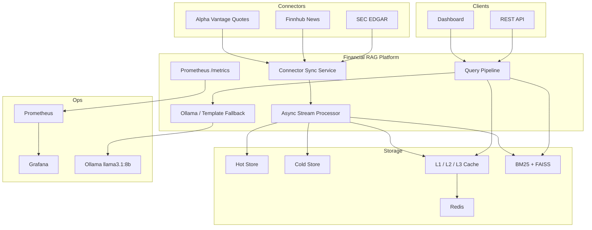

# Architecture Diagram

The system now operates as a financial intelligence platform rather than a benchmark-only MVP.

## Integration Approach

- Connectors normalize provider data into internal `Document` objects.
- `ConnectorSyncService` polls providers and emits `IngestionEvent`s.
- `StreamProcessor` remains the single ingestion path for embedding, indexing, and cache invalidation.
- Query processing still uses hybrid retrieval, semantic caching, freshness scoring, and reranking.
- Ollama replaces template-only generation while preserving the existing inference interface and fallback behavior.
